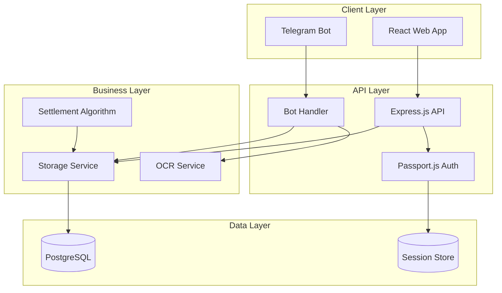

# Design Document

## Overview

PLANPAL is a comprehensive expense coordination system that combines a React-based web application with Telegram bot integration to facilitate group expense tracking and settlement. The system is built on a modern TypeScript stack with PostgreSQL for data persistence, focusing on human agreement and social fairness rather than payment execution.

The architecture follows a three-tier design:
- **Presentation Layer**: React web application and Telegram bot interface
- **Business Logic Layer**: Express.js API with comprehensive validation and business rules
- **Data Layer**: PostgreSQL database with Drizzle ORM for type-safe data access

## Architecture

### System Components



### Technology Stack

**Frontend:**
- React 18 with TypeScript
- Wouter for routing
- Radix UI for components
- TanStack Query for state management
- Tailwind CSS for styling
- Framer Motion for animations

**Backend:**
- Node.js with Express.js
- TypeScript for type safety
- Passport.js for authentication
- node-telegram-bot-api for Telegram integration
- Tesseract.js for OCR processing

**Database:**
- PostgreSQL for primary data storage
- Drizzle ORM for type-safe database access
- connect-pg-simple for session storage

**Validation & Security:**
- Zod for schema validation
- bcrypt for password hashing
- Express sessions with PostgreSQL store

## Components and Interfaces

### Web Application Components

#### Authentication System
```typescript
interface AuthService {
  login(credentials: LoginCredentials): Promise<User>
  register(userData: RegisterData): Promise<User>
  logout(): Promise<void>
  getCurrentUser(): Promise<User | null>
}

interface LoginCredentials {
  username: string
  password: string
}

interface RegisterData {
  username: string
  password: string
  telegramId?: string
  telegramUsername?: string
}
```

#### Event Management
```typescript
interface EventService {
  createEvent(event: InsertEvent): Promise<Event>
  getEvents(userId: number): Promise<Event[]>
  getEvent(id: number): Promise<EventWithDetails>
  updateEvent(id: number, data: Partial<InsertEvent>): Promise<Event>
  deleteEvent(id: number): Promise<void>
}

interface EventWithDetails extends Event {
  expenses: Expense[]
  payments: Payment[]
}
```

#### Expense Management
```typescript
interface ExpenseService {
  createExpense(expense: InsertExpense): Promise<Expense>
  getExpenses(eventId: number): Promise<Expense[]>
  updateExpenseStatus(id: number, status: ExpenseStatus): Promise<void>
  updateExpenseVotes(id: number, votes: VoteRecord): Promise<void>
}

type ExpenseStatus = 'PENDING' | 'CONFIRMED' | 'REJECTED'
type VoteRecord = Record<string, 'agree' | 'disagree'>
```

### Telegram Bot Interface

#### Command Handlers
```typescript
interface BotCommandHandler {
  handleStart(msg: TelegramMessage, eventCode?: string): Promise<void>
  handleStartEvent(msg: TelegramMessage, eventCode: string): Promise<void>
  handleAddExpense(msg: TelegramMessage, amount: number, description: string, mentions: string[]): Promise<void>
  handleAddExpenseWithImage(msg: TelegramMessage, image: TelegramPhoto, mentions: string[]): Promise<void>
  handleManualExpenseEntry(msg: TelegramMessage): Promise<void>
  handlePaid(msg: TelegramMessage, toUser: string, amount: number): Promise<void>
  handleConfirmPayment(msg: TelegramMessage, fromUser: string, amount: number): Promise<void>
  handleSummary(msg: TelegramMessage): Promise<void>
  handleReport(msg: TelegramMessage): Promise<void>
  handleCloseEvent(msg: TelegramMessage): Promise<void>
}
```

#### OCR Processing Interface
```typescript
interface OCRService {
  processInvoiceImage(imageBuffer: Buffer): Promise<OCRResult>
  extractAmountFromText(text: string): number | null
  extractDescriptionFromText(text: string): string
  validateOCRConfidence(result: OCRResult): boolean
  shouldTriggerManualEntry(result: OCRResult): boolean
}

interface OCRResult {
  text: string
  confidence: number
  amount?: number
  description?: string
  merchantName?: string
  isUnclear: boolean
}

interface ManualEntryHandler {
  initiateManualEntry(userId: string, mentions: string[]): Promise<void>
  handleManualAmount(userId: string, amount: number): Promise<void>
  handleManualDescription(userId: string, description: string): Promise<void>
  confirmManualEntry(userId: string): Promise<void>
  cancelManualEntry(userId: string): Promise<void>
}

interface ConversationState {
  userId: string
  step: 'awaiting_amount' | 'awaiting_description' | 'awaiting_confirmation'
  mentions: string[]
  amount?: number
  description?: string
  originalImageData?: Buffer
}
```

### Storage Layer Interface

```typescript
interface IStorage {
  // User Management
  getUser(id: number): Promise<User | undefined>
  getUserByUsername(username: string): Promise<User | undefined>
  createUser(user: InsertUser): Promise<User>
  getUserByTelegramId(telegramId: string): Promise<User | undefined>
  linkUserTelegram(userId: number, telegramId: string, telegramUsername?: string): Promise<void>

  // Event Management
  createEvent(event: InsertEvent): Promise<Event>
  getEvent(id: number): Promise<Event | undefined>
  getEventByCode(code: string): Promise<Event | undefined>
  getEventByTelegramGroupId(groupId: string): Promise<Event | undefined>
  getEventsForUser(userId: number): Promise<Event[]>
  updateEventTelegramGroup(eventId: number, groupId: string): Promise<void>
  updateEventStatus(eventId: number, status: string): Promise<void>
  updateEvent(id: number, data: Partial<InsertEvent>): Promise<Event>
  deleteEvent(id: number): Promise<void>

  // Expense Management
  createExpense(expense: InsertExpense): Promise<Expense>
  getExpense(id: number): Promise<Expense | undefined>
  getExpensesForEvent(eventId: number): Promise<Expense[]>
  updateExpenseVotes(expenseId: number, votes: Record<string, 'agree' | 'disagree'>): Promise<void>
  updateExpenseStatus(expenseId: number, status: string): Promise<void>

  // Payment Management
  createPayment(payment: InsertPayment): Promise<Payment>
  getPayment(id: number): Promise<Payment | undefined>
  getPaymentsForEvent(eventId: number): Promise<Payment[]>
  updatePaymentStatus(paymentId: number, status: string): Promise<void>
}
```

## Data Models

### Core Entities

```typescript
// User Entity
interface User {
  id: number
  username: string
  password: string
  telegramId?: string
  telegramUsername?: string
  createdAt?: Date
}

// Event Entity
interface Event {
  id: number
  code: string
  name: string
  date: Date
  location?: string
  description?: string
  creatorId: number
  telegramGroupId?: string
  status: 'CREATED' | 'ACTIVE' | 'CLOSED'
  createdAt?: Date
}

// Expense Entity
interface Expense {
  id: number
  eventId: number
  payerId: number
  payerUsername?: string
  description: string
  amount: number // Stored in cents
  splitAmong?: string[]
  votes?: Record<string, 'agree' | 'disagree'>
  status: 'PENDING' | 'CONFIRMED' | 'REJECTED'
  createdAt?: Date
}

// Payment Entity
interface Payment {
  id: number
  eventId: number
  fromUserId: number
  fromUsername?: string
  toUserId: number
  toUsername?: string
  amount: number // Stored in cents
  status: 'PENDING' | 'CONFIRMED'
  createdAt?: Date
}
```

### Database Schema

```sql
-- Users table
CREATE TABLE users (
  id SERIAL PRIMARY KEY,
  username TEXT NOT NULL UNIQUE,
  password TEXT NOT NULL,
  telegram_id TEXT,
  telegram_username TEXT,
  created_at TIMESTAMP DEFAULT NOW()
);

-- Events table
CREATE TABLE events (
  id SERIAL PRIMARY KEY,
  code TEXT NOT NULL UNIQUE,
  name TEXT NOT NULL,
  date TIMESTAMP NOT NULL,
  location TEXT,
  description TEXT,
  creator_id INTEGER NOT NULL REFERENCES users(id),
  telegram_group_id TEXT,
  status TEXT DEFAULT 'CREATED',
  created_at TIMESTAMP DEFAULT NOW()
);

-- Expenses table
CREATE TABLE expenses (
  id SERIAL PRIMARY KEY,
  event_id INTEGER NOT NULL REFERENCES events(id),
  payer_id INTEGER NOT NULL REFERENCES users(id),
  payer_username TEXT,
  description TEXT NOT NULL,
  amount INTEGER NOT NULL,
  split_among JSONB,
  votes JSONB,
  status TEXT DEFAULT 'PENDING',
  created_at TIMESTAMP DEFAULT NOW()
);

-- Payments table
CREATE TABLE payments (
  id SERIAL PRIMARY KEY,
  event_id INTEGER NOT NULL REFERENCES events(id),
  from_user_id INTEGER NOT NULL REFERENCES users(id),
  from_username TEXT,
  to_user_id INTEGER NOT NULL REFERENCES users(id),
  to_username TEXT,
  amount INTEGER NOT NULL,
  status TEXT DEFAULT 'PENDING',
  created_at TIMESTAMP DEFAULT NOW()
);
```

## Correctness Properties

*A property is a characteristic or behavior that should hold true across all valid executions of a system-essentially, a formal statement about what the system should do. Properties serve as the bridge between human-readable specifications and machine-verifiable correctness guarantees.*

Based on the prework analysis, the following correctness properties validate the system's behavior:

### Property 1: Authentication and Authorization
*For any* user attempting to access protected resources, the system should only grant access after successful authentication and proper authorization based on their role and event participation.
**Validates: Requirements 1.1, 1.2, 1.6, 9.1, 9.2, 9.4, 9.6**

### Property 2: Event Code Uniqueness and Lifecycle
*For any* event creation, the system should generate a unique event code and properly manage the event lifecycle from CREATED to ACTIVE to CLOSED states with appropriate restrictions at each stage.
**Validates: Requirements 1.3, 1.7, 7.1, 7.2, 7.5, 7.6**

### Property 3: Telegram Bot Command Processing
*For any* valid Telegram command with proper parameters, the bot should parse the command correctly, validate user authorization, and execute the appropriate business logic while rejecting invalid commands with helpful error messages.
**Validates: Requirements 2.1, 2.2, 2.3, 2.4, 2.6, 3.1, 3.5, 3.6, 4.1, 4.4**

### Property 4: Expense Creation and Status Management
*For any* expense creation request, the system should set the correct status (CONFIRMED for single-user, PENDING for multi-user), store all expense details accurately, and properly manage the splitAmong array.
**Validates: Requirements 3.2, 3.3, 3.7, 4.5**

### Property 5: Settlement Algorithm Correctness
*For any* set of confirmed expenses and payments, the settlement algorithm should calculate net balances that sum to zero, split costs equally among participants, and generate optimal settlement recommendations with minimal transfers.
**Validates: Requirements 5.1, 5.2, 5.3, 5.4, 5.5, 5.6, 6.4, 6.6**

### Property 6: Payment Workflow Integrity
*For any* payment acknowledgment and confirmation sequence, the system should correctly match payments by amount and participants, update payment status appropriately, and maintain payment integrity throughout the process.
**Validates: Requirements 4.2, 4.6, 4.7, 8.5**

### Property 7: Data Persistence and Consistency
*For any* data operation (create, read, update, delete), the system should maintain ACID properties, preserve referential integrity, handle concurrent operations safely, and store all monetary amounts as integers to avoid precision issues.
**Validates: Requirements 8.1, 8.2, 8.4, 8.6, 8.7**

### Property 8: OCR Processing and Manual Fallback Integration
*For any* invoice image uploaded with expense commands, the OCR system should extract text using Tesseract.js, parse amounts and descriptions with currency pattern matching, and when OCR confidence is low or extraction fails, seamlessly transition to manual entry workflow while preserving mentioned participants and maintaining conversation state throughout the process.
**Validates: Requirements 10.1, 10.2, 10.3, 10.4, 10.5, 10.6, 10.7, 10.8, 10.9, 10.10, 10.11, 10.12**

### Property 9: Reporting and Summary Accuracy
*For any* summary or report request, the system should calculate totals correctly, include only confirmed expenses and payments, format monetary amounts consistently, and provide accurate settlement recommendations.
**Validates: Requirements 6.1, 6.2, 6.3, 6.5, 6.7**

### Property 10: Event Closure Validation
*For any* event closure request, the system should verify all expenses and payments are resolved, reject closure if pending items exist, and prevent further modifications once closed while providing final reports.
**Validates: Requirements 7.3, 7.4, 7.7**

### Property 11: Input Validation and Security
*For any* user input across web and Telegram interfaces, the system should validate data using Zod schemas, sanitize inputs to prevent injection attacks, hash passwords securely, and maintain data integrity.
**Validates: Requirements 9.3, 9.5**

## Error Handling

### Web Application Error Handling
- **Authentication Errors**: Invalid credentials return 401 with clear error messages
- **Authorization Errors**: Insufficient permissions return 403 with explanation
- **Validation Errors**: Invalid input returns 400 with field-specific error details
- **Not Found Errors**: Missing resources return 404 with helpful guidance
- **Server Errors**: Internal errors return 500 with generic message while logging details

### Telegram Bot Error Handling
- **Invalid Commands**: Respond with usage instructions and examples
- **Missing Parameters**: Prompt for required parameters with format guidance
- **Authorization Failures**: Explain permission requirements and how to gain access
- **Processing Errors**: Provide clear error messages with suggested next steps
- **OCR Failures**: Guide users on improving image quality and manual fallback options

### Database Error Handling
- **Connection Failures**: Implement retry logic with exponential backoff
- **Constraint Violations**: Return meaningful error messages for business rule violations
- **Transaction Failures**: Rollback changes and provide recovery guidance
- **Data Corruption**: Validate data integrity and provide repair mechanisms

## Testing Strategy

### Dual Testing Approach
The system employs both unit testing and property-based testing for comprehensive coverage:

**Unit Tests** focus on:
- Specific examples and edge cases
- Integration points between components  
- Error conditions and boundary cases
- UI component behavior and user interactions

**Property-Based Tests** focus on:
- Universal properties that hold for all inputs
- Comprehensive input coverage through randomization
- Business rule validation across diverse scenarios
- Data integrity and consistency verification

### Property-Based Testing Configuration
- **Testing Library**: Use fast-check for JavaScript/TypeScript property-based testing
- **Minimum Iterations**: 100 iterations per property test to ensure thorough coverage
- **Test Tagging**: Each property test references its design document property
- **Tag Format**: `Feature: planpal, Property {number}: {property_text}`

### Testing Implementation Guidelines
Each correctness property must be implemented as a single property-based test that:
1. Generates random valid inputs within the property's domain
2. Executes the system behavior being tested
3. Verifies the property holds for all generated inputs
4. Provides clear failure messages when properties are violated

### Example Property Test Structure
```typescript
// Feature: planpal, Property 5: Settlement Algorithm Correctness
describe('Settlement Algorithm Properties', () => {
  it('should ensure net balances sum to zero', () => {
    fc.assert(fc.property(
      fc.array(expenseGenerator),
      fc.array(paymentGenerator),
      (expenses, payments) => {
        const balances = calculateNetBalances(expenses, payments);
        const sum = Object.values(balances).reduce((a, b) => a + b, 0);
        expect(Math.abs(sum)).toBeLessThan(1); // Allow for rounding to nearest cent
      }
    ), { numRuns: 100 });
  });
});
```

### Integration Testing
- **API Integration**: Test complete request/response cycles
- **Database Integration**: Verify data persistence and retrieval
- **Telegram Integration**: Test bot command processing end-to-end
- **OCR Integration**: Test image processing and data extraction workflows

### Performance Testing
- **Load Testing**: Verify system performance under concurrent users
- **Stress Testing**: Test system limits and graceful degradation
- **OCR Performance**: Measure image processing times and optimize accordingly
- **Database Performance**: Monitor query performance and optimize slow queries